# Introduction
This readMe file explains how to use the MONSTER simulation tool to examine signal power and SINR for LTE systems. As the received power and SINR are strong indicators of the signal quality assessing these when planning/evaluating a setup for mobile communications is essential. 

# Requirements
To use the MONSTER simulation tool the following requirements must be met:

* Matlab version 2018a or newer installed and running - including the [LTE system toolbox](https://se.mathworks.com/products/lte-system.html) and dependencies.
* A clone of the MONSTeR toolbox from [Github](https://github.com/Sonohi/monster)

# Getting started
Once the clone is copied to your local machine open Matlab and follow these steps:
* Navigate to the root of the toolbox (called "monster"). 
* Run the `install.m` script, either from the editor or by calling it in the command window of Matlab. This adds all the folders and subfolders to the Matlab path. 
* You are now ready to use the tool.

# Run script
In the "examples" folder you will find a subfolder called "PowerSINRmap" and within this folder a script called `plotPowerSINR.m`. Run this script to obtain results about the signal power distribution and the SINR. This produces 2 figures, which should look like this:

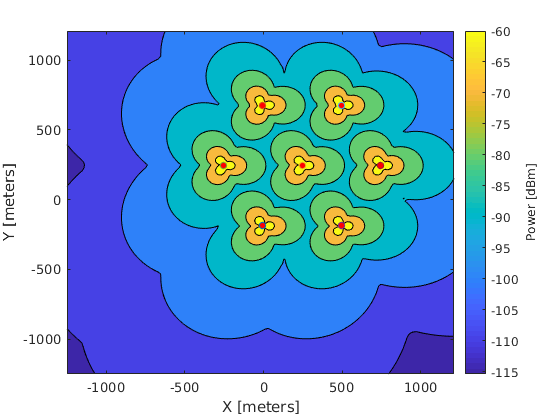
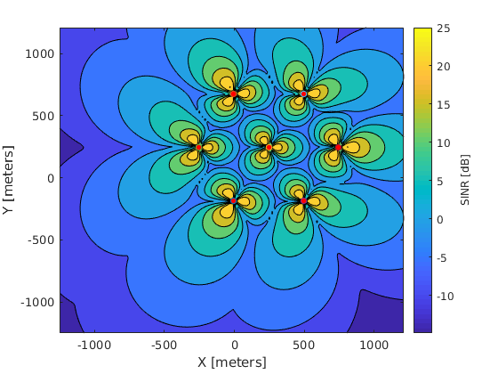

Running the sricpt may take several minutes, depending on the hardware.

## What does the script do?
The scripts sets up a Monster instance. The simulated environment consists of 7 sites, each with 3 eNBs. After setting up the simulation, two plot are generated using the `plotSINR` and `plotPower` property of the channel model. Both of these works by placing a user at all coordinates of a grid and measuring received signal power or SINR. The grid is defined by the resolution paramter, which is set to 20m. 

By changing some of the parameter different results will be produced for inspection. The basic relevant settings are:

`Config.MacroEnb.sitesNumber = 7;`

`Config.MacroEnb.cellsPerSite = 3;`

`Config.Channel.shadowingActive = false;`

`Config.Channel.losMethod = 'NLOS';`

`Config.MacroEnb.antennaType = 'sectorised';`

`resolution = 20;`

# Change paramters
Changes the parameters provides insight into power and intererrence of LTE. To best understand the effects of each paramter it is recommended to only change 1 paramter, run the scripts, and then change it back to "standard" before the next paramter is changed.

## Number of sites
By changing the number of sites the patterns should become more consistent. Try increasing the number of sites e.i. `Config.MacroEnb.sitesNumber = 21;`. You should see a figure similar to this for the SINR:
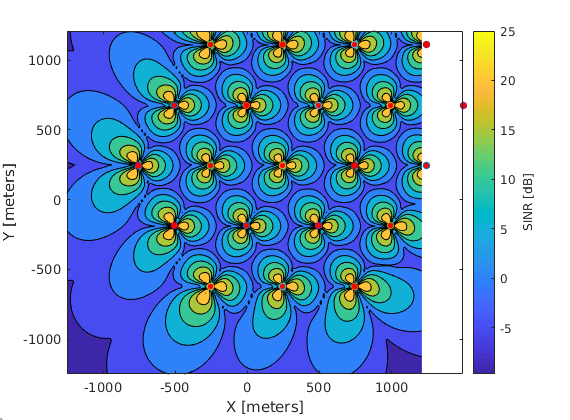

Also try to lower the number sites to 1 and observe. It should look like this:
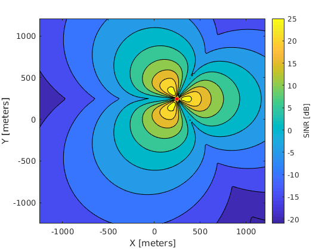

## Sectorised and omnidirectional
The "standard" scenario uses a setup with 3 eNBs at each site and a directional antenna. To go from directional or sectorised change the paramter to `Config.MacroEnb.antennaType = 'omni';`. As it does not make sense to have 3 omnidirectional antennas right next to each other, also change the number of cells per site to `Config.MacroEnb.cellsPerSite = 1;`. 

For the the SINR and power results, plots similar to these should be obtained:

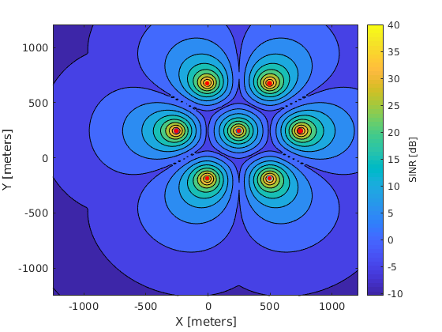
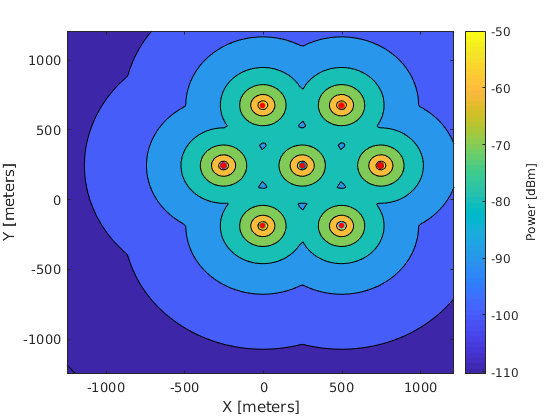

[comment]: <## Shadowing>
[comment]: <Turning on the shadowing produces some different plots. Turn on shadowing by setting `Config.Channel.shadowingActive = true;`. Now plots like these should be obtained:>

[comment]: <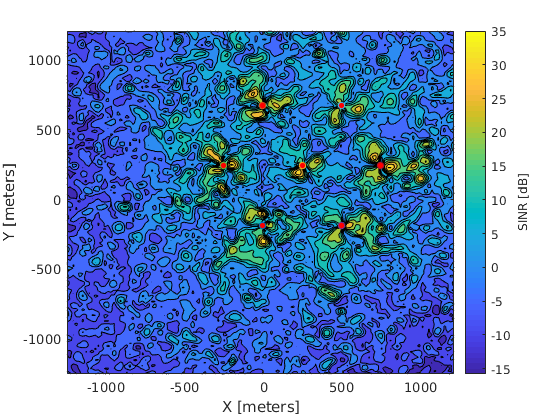>
[comment]: <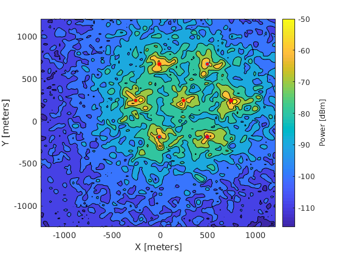>

[comment]: <When turning on shadowing...>

## Resolution
To closer inspect certain areas, the resolution can be increased at the cost of slower computation. Likewise if faster computations are desired lowering the resolution is recommended. Note that setting `resolution` to a smaller number will increase the resolution as the number describes the distance between each point.

The resolution is set to 20 as "standard" for these plots, as the level of information is not really increased when going to a resolution of e.i. 5. Instead try to gradually increase the resolution and examine when the sectorised patterne become hard to recognize. 

## LOS
Line of sight plays a large role in dertermening the signal strength and interferrence. The "standard" `'NLOS'` assumes that all point are partially obstructed. 

Changing the LOS to `'3GPP38901-probability'` will produce plots like these:

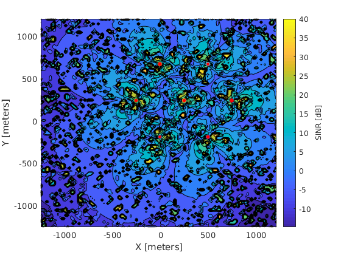
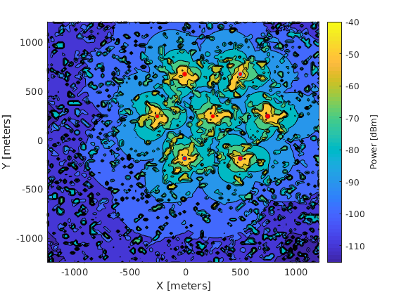

When inspexted closely the plot look like the former, but with many "islands" scattered all over. These "islands" represent points where the algorith determines a probability of line of sight following this [standard](https://www.etsi.org/deliver/etsi_tr/138900_138999/138901/14.03.00_60/tr_138901v140300p.pdf).

[comment]: <Changing the LOS method to `'LOS'`...>

[comment]: <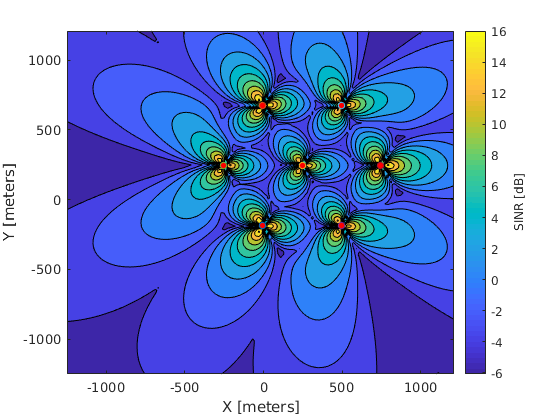>
[comment]: <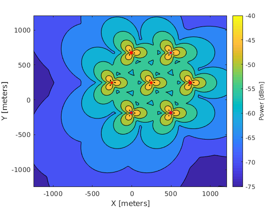>

